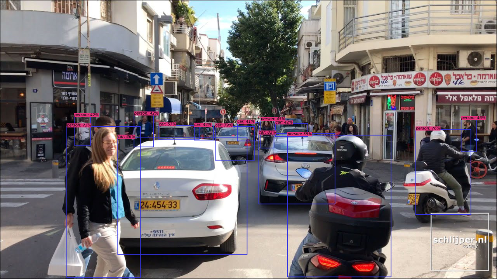
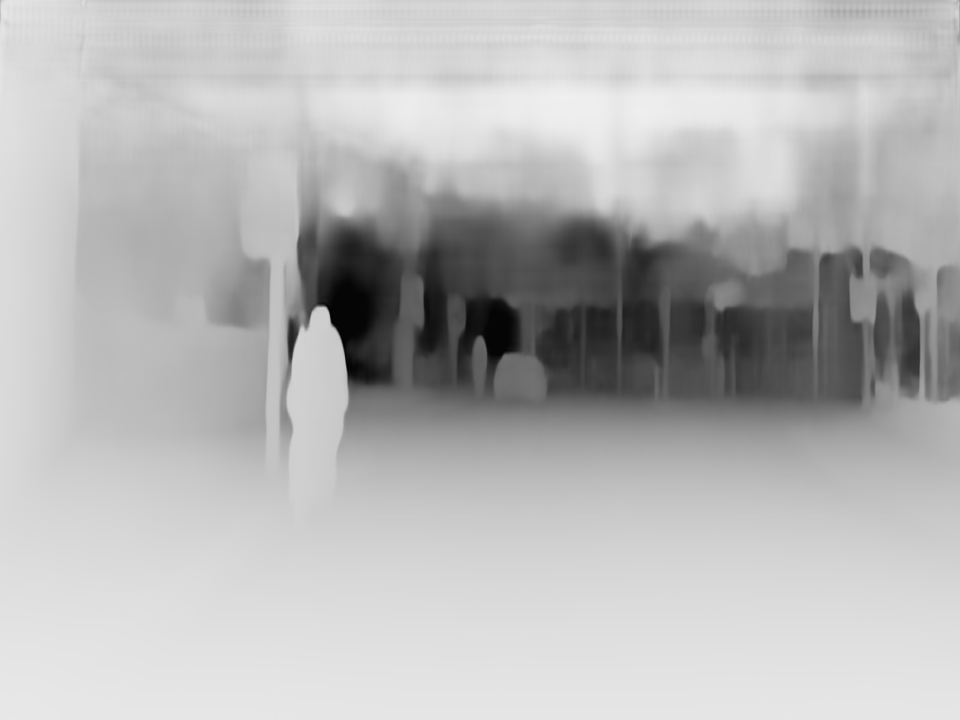

The Cloud Vision API enables developers to integrate state-of-the-art computer vision algorithms in a line of code, without any algorithmic or integration struggle. [Try it in Colab](https://colab.research.google.com/drive/1u2i_-EdbXYYK6D5e95E0h6Scg3UkDTbR?usp=sharing)!

<table>
    <tr><td>
Object Detection
</td><td>
Depth
</td></tr>
    <tr><td></td><td></td></tr>
</table>

## Repo content
This repo contains:
* A [notebook](test_api.ipynb) showing how to use the API in a python environment with only basic libraries (requests, pillow, ...)
* An [app](https://drive.google.com/open?id=1tPdnUmslA8EeusONc26vTbXXIY6aJ9Nx) written with [Flutter](https://github.com/flutter/flutter).

## Algorithms available in the API (and credits)
The Cloud Vision API enables developers to integrate state-of-the-art computer vision algorithms in a line of code, without any algorithmic or integration struggle. Below is the list of algorithms currently available in the API:
* **Object Detection**: locates and classifies objects in a given picture.  
    * Option 1: Based on the paper [DETR: End-to-End Object Detection With Transformers](https://alcinos.github.io/detr_page/)
    * Option 2: Based on the paper ["EfficientDet: Scalable and Efficient Object Detection"](https://arxiv.org/pdf/1911.09070.pdf), ranked #2 as of May 2020 on [COCO's Test set](https://paperswithcode.com/sota/object-detection-on-coco).
* **Panoptic Segmentation**: Each pixel is assigned a class label and all object instances are uniquely segmented.
    * Based on the paper [DETR: End-to-End Object Detection With Transformers](https://alcinos.github.io/detr_page/)
* **Monocular Depth Estimation**:  estimates how far each pixel is from the camera  
    * Based on the paper ["From Big to Small: Multi-Scale Local Planar Guidance for Monocular Depth Estimation"](https://arxiv.org/pdf/1907.10326v5.pdf), currently state-of-the-art on [KITTI and MIT Datasets](https://paperswithcode.com/task/monocular-depth-estimation), and its [PyTorch implementation](https://github.com/Navhkrin/Bts-PyTorch). A video of the algorithm's results can be found [here](https://www.youtube.com/watch?v=ekezJiGaiQk&feature=youtu.be)
    
You think that another algorithm should be included in this API? Please tell me about it at [sebderhy@gmail.com](sebderhy@gmail.com).

## Limits of the API
* Since the server cost is currently on me, I cannot use a powerful server, and therefore, large images may fail. 
* When you submit an image, the results may take about 20 seconds to arrive.
* The algorithms provided here can have variable results quality depending on the context. For more details about each algorithm's performances, please refer to the papers mentioned above.
* Keep in mind that this is a side-project and not a finished product yet! Although I do my best to keep everything working and resilient, the results may be disappointing, and the server may fail (apologies if that's the case). In any case, please share your feedback with me (sebderhy@gmail.com), so that I can improve it accordingly.   

## Why this project ?
I've always been passionated about how cutting-edge research (in particular AI) is translated into real world impact. The truth is that we live in a world where great research sometimes take several years before actually being deployed and making an impact. 

Therefore, I wanted to make the best AI algorithms (starting with computer vision) accessible in a few lines of code, so that:
* Developers without AI expertise can use the best algorithms in their code without struggling with any integration
* AI researchers can maximize the impact of their code, and go beyond the "demo" stage.   
* People can quickly see if a given open-source AI algorithm can work well in their use-case.  

Although, this project is still at its infancy, it can be compared to:
* The computer vision APIs from [Microsoft](https://azure.microsoft.com/en-us/services/cognitive-services/computer-vision/#features), [Amazon](https://aws.amazon.com/rekognition/), and [Google](https://cloud.google.com/vision). However, these APIs do not propose most of the algorithms that are included in this API.
* What [Hugging Face](https://huggingface.co/) is doing for Natural Language Processing. HF has actually been a great source of inspiration here for me, since any developper can build state-of-the-art NLP with a few lines of code thanks to their library.

## Contact
Don't hesitate to contact me at sebderhy@gmail.com for any feedback / request / question. Please let me know also if there is also any algorithm that you think I should add to this API.
