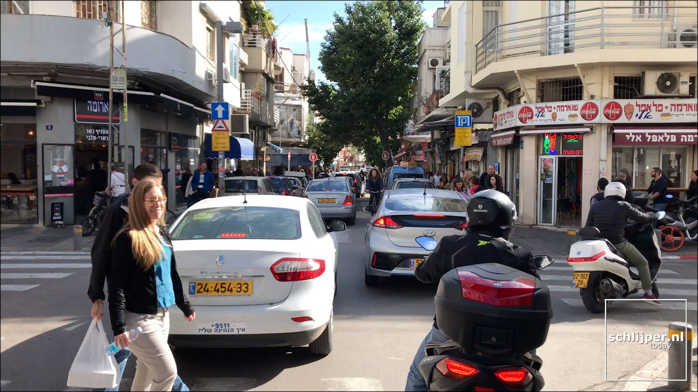

# Cloud Vision API
The Cloud Vision API enables developers to integrate state-of-the-art computer vision algorithms in a line of code, without any algorithmic or integration struggle. 

<table>
    <tr><td>
input image
</td><td>
semantic segmentation
</td></tr>
    <tr><td></td><td></td></tr>
    <tr><td>
Super-resolution
</td><td>
Depth
</td></tr>
    <tr><td></td><td></td></tr>
    <tr><td>
Style Transfer 1
</td><td>
Style Transfer 3
</td></tr>
    <tr><td></td><td></td></tr>
    <tr><td>
Input selfie
</td><td>
Background Swap
</td></tr>
    <tr><td></td><td></td></tr>

</table>

## Repo content
This repo contains:
* A [notebook](test_api.ipynb) showing how to use the API in a python environment with only basic libraries (requests, pillow, ...)
* An app written with [Flutter](https://github.com/flutter/flutter). The app itself will be available soon.
* A [web demo](http://www.visionapidemo.com) built with Jupyter ipywidgets, and deployed with [voila](https://blog.jupyter.org/and-voil%C3%A0-f6a2c08a4a93)

## Algorithms available in the API (and credits)
The algorithms from this API are all based on great notebooks / github repositories, which I highly recommend to look at: 
* **Super-resolution**: enhances the quality of an image  
*Based on the [fastai notebook](https://github.com/fastai/fastai2/blob/master/nbs/course/lesson7-superres.ipynb)*
* **Style Transfer**: transform a photo into a piece of art  
*Based on [Zachary Mueller](https://github.com/muellerzr)'s [notebook](https://github.com/muellerzr/Practical-Deep-Learning-for-Coders-2.0/blob/master/Computer%20Vision/05_Style_Transfer.ipynb)*
* **Semantic Segmentation**: classifies each pixel of the picture into a class such as car, pedestrian, road, etc...  
*Based on [Zachary Mueller](https://github.com/muellerzr)'s [notebook](https://github.com/muellerzr/Practical-Deep-Learning-for-Coders-2.0/blob/master/Computer%20Vision/04_Segmentation.ipynb)*
* **Background Segmentation**: creates a mask to separate between the foreground and background in portrait pictures  
*Based on [Zachary Mueller](https://github.com/muellerzr)'s [notebook](https://github.com/muellerzr/Practical-Deep-Learning-for-Coders-2.0/blob/master/Computer%20Vision/07_Binary_Segmentation.ipynb)*
* **Monocular Depth Estimation**:  estimates how far each pixel is from the camera  
*Based on the paper ["From Big to Small: Multi-Scale Local Planar Guidance for Monocular Depth Estimation"](https://arxiv.org/pdf/1907.10326v5.pdf), currently state-of-the-art on [KITTI and MIT Datasets](https://paperswithcode.com/task/monocular-depth-estimation), and its [PyTorch implementation](https://github.com/Navhkrin/Bts-PyTorch)*. Visual results of this algorithm can be found [here](https://www.youtube.com/watch?v=ekezJiGaiQk&feature=youtu.be)

## Limits of the API
1. The API currently officially supports **only** images < 2MB. While larger images may work, they may undergo downsizing in the process, and it might affect the quality of the results (in particular for Super-resolution where the image's details are important).
2. The *semantic segmentation and depth estimation* algorithms will work well **only on road pictures** (i.e. pictures taken from a car), because they have been trained on such datasets.
3. The *depth algorithm* has (at least) one known issue: it **always sees the sky as very close** (is that a message from above?!). An easy fix to this issue is to combine it with semantic segmentation algorithm and force "sky" pixels to get very far depth.
4. The Background segmentation algorithm will work **only on portraits/selfies**, and is currently **only giving a rough contour** (typically, it will miss the subtilities in hair)
5. In general, this is a side-project and is not considered as a finished product. Although I do my best to keep it working and resilient, the server may not be available or fail.

In general, if you have any request, feedback or question, please contact me at sebderhy@gmail.com, and I'll do my best to help.

## Why this project ?
I've always been passionated about how cutting-edge research (in particular AI) is translated into real world impact. The truth is that we live in a world where great research sometimes take several years before actually being deployed and making an impact. Conversely, promising research can sometimes end-up as a huge failure when used in the real-life. 

Therefore, I wanted to make the best AI algorithms (starting with computer vision) accessible in a line of code, so that:
* Developpers without AI expertise can use the best algorithms in their code without struggling with any integration
* AI researchers can have their code usable by the whole world without struggling with deployment and dev ops   
* More transparency is brought into the AI research world, and the strength and limitations of each algorithm becomes quickly apparent. 

Although, this project is still at its infancy, it can be compared to:
* The computer vision APIs from [Microsoft](https://azure.microsoft.com/en-us/services/cognitive-services/computer-vision/#features), [Amazon](https://aws.amazon.com/rekognition/), and [Google](https://cloud.google.com/vision). However, these APIs do not propose most of the algorithms that are included in this API.
* What [Hugging Face](https://huggingface.co/) is doing for Natural Language Processing. HF has actually been a great source of inspiration here for me, since any developper can use state-of-the-art NLP with a few lines of code.

## Contact
Don't hesitate to contact me at sebderhy@gmail.com for any feedback / request / question. Please let me know also if there is also any algorithm that you think I should add to this API.
